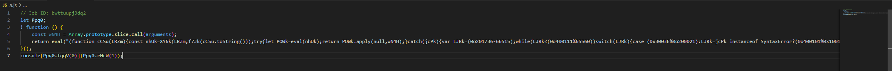
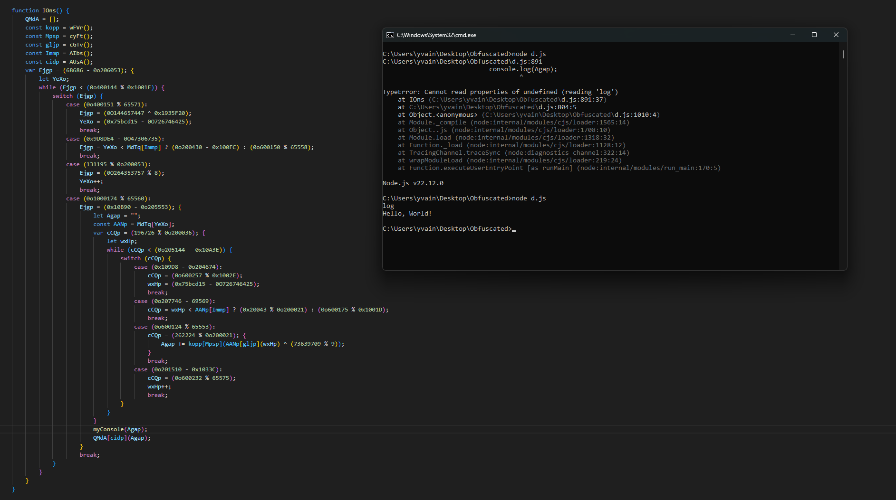

# **JSDefender Deobfuscator**

⚠️ **This project is intended to be used only in a secure environment.** ⚠️

*This tool performs dynamic analysis of obfuscated code. While the tool is designed to avoid executing malicious code, use it with caution and only in trusted, isolated environments.*

A powerful JavaScript deobfuscator designed to analyze and transform obfuscated code generated by **JSDefender** into readable and understandable code. This project is especially useful for security analysis, reverse engineering, and learning about obfuscation techniques.

---

## 🚀 **Features**

- Detection and decryption of obfuscated values and functions.
- Analysis and reconstruction of mathematical expressions.
- **REPL mode** to interact directly with the deobfuscated code.
- Automatic beautification of the final output.

## 🛠️ **Installation**

1. **Clone the repository:**

    ```bash
    git clone https://github.com/your-username/jsdefender-deobfuscator.git
    cd jsdefender-deobfuscator
    ```

2. **Install dependencies:**

    ```bash
    npm install
    ```

---

## 📚 **Usage**

* **Available Commands:**

  ```
  node deobfuscator.js [options]
  ```

* **Options:**

  | Option | Description |
  |-|-|
  | `-h`  | Display the help menu.
  | `-i <filename>` |	Specify the input file (obfuscated code).
  | `-o <filename>` |	Specify the output file (deobfuscated code).
  | `-r`	| Launch a REPL mode with preloaded code.
  | `-v`	| Enable verbose mode for detailed output during the deobfuscation process.
  | `-l`	| Display licensing information.
  | `--no-colors` | Disable colorized output.

* **Examples:**

  1. **Simple deobfuscation:**

      ```bash
      node deobfuscator.js -i input.js -o output.js
      ```

  2. **Deobfuscation with verbose mode:**

      ```bash
      node deobfuscator.js -i input.js -o output.js -v
      ```

  3. **Launch an interactive REPL:**

      ```bash
      node deobfuscator.js -i input.js -r
      ```

## 🧠 **How It Works**

  <details>
  <summary>click here :3</summary>
  
  To explain how JSDefender works and how my deobfuscator operates, I’ve obfuscated a simple “Hello World” example:

  

  By making the code clearer, we get this:

  

  Here we can see several parts. First:

  ```js
  let Ppq0;
  ```

  This variable is actually a dictionary that will contain all the functions required to obtain the deobfuscated values.

  Next, there’s a part with an `eval`. This section will assign all the values to `Ppq0`. We’ll come back to this shortly.

  Finally, we have:

  ```js
  console[Ppq0.fqqV(0)](Ppq0.rHcW(1));
  ```

  This part is the actual code, equivalent to:
  
  ```js
  console.log("Hello, World!");
  ```
  
  in our example.

  As we can see, `Ppq0` is responsible for retrieving the deobfuscated values.

  Looking closer at the code within the `eval`, it takes the following argument:

  

  On closer inspection, we see:

  ```js
  let POWk=eval(nhUk);return POWk.apply(null,wN4H);
  ```

  and: 

  ```js
  const nhUk=XY6k(LRZm,f7Jk(cCSu.toString()));
  ```

  In this code, `cCSu` is the function, `cCSu.toString()` returns the raw code of this function, `LRZm` is the parameter (which contains a large encrypted string), and `f7Jk` is a hashing function:

  ```js
      function f7Jk(HEMk) {
        let b2Ek = 1982467754;
        var DzHk = (0o400114 % 65560); {
            let DBel;
            while (DzHk < (0x105F0 - 0o202712)) {
                switch (DzHk) {
                    case (0o600071 % 0x10008):
                        DzHk = (66976 - 0o202624); {
                            b2Ek ^= (HEMk.charCodeAt(DBel) * (15658734 ^ 0O73567354) + HEMk.charCodeAt(DBel >>> (0x4A5D0CE & 0O320423424))) ^ 1126775079;
                        }
                        break;
                    case (0o202260 - 66724):
                        DzHk = (131177 % 0o200042);
                        DBel++;
                        break;
                    case (262345 % 0o200051):
                        DzHk = DBel < HEMk.length ? (0o400107 % 0x10013) : (68196 - 0o205076);
                        break;
                    case (0o1000164 % 0x10016):
                        DzHk = (0o205036 - 0x109F9);
                        DBel = (0x75bcd15 - 0O726746425);
                        break;
                }
            }
        }
  ```

  Lastly, we have the `XY6k` function, which decrypts the first argument using the second argument (the hash of the function) as a key:

  ```js
      function XY6k(rmZk, TT1k) {
        rmZk = decodeURI(rmZk);
        let TVyl = (0x21786 % 3);
        let vtBl = "";
        var PQtl = (0o203650 - 0x1078C); {
            let rowl;
            while (PQtl < (0o200574 - 65878)) {
                switch (PQtl) {
                    case (0o201224 - 66163):
                        PQtl = (0o200360 - 65764); {
                            vtBl += String.fromCharCode(rmZk.charCodeAt(rowl) ^ TT1k.charCodeAt(TVyl));
                            TVyl++;
                            var LLol = (0x101E0 - 0o200720);
                            while (LLol < (0x104B0 - 0o202222)) switch (LLol) {
                                case (0o600061 % 0x1000B):
                                    LLol = TVyl >= TT1k.length ? (0x3008D % 0o200046) : (0o400134 % 65567);
                                    break;
                                case (67426 - 0o203507):
                                    LLol = (0o600165 % 65565); {
                                        TVyl = (0x21786 % 3);
                                    }
                                    break;
                            }
                        }
                        break;
                    case (69606 - 0o207701):
                        PQtl = rowl < rmZk.length ? (0o1000161 % 65556) : (68196 - 0o205076);
                        break;
                    case (67216 - 0o203164):
                        PQtl = (0o1000301 % 65575);
                        rowl = (0x21786 % 3);
                        break;
                    case (0x40064 % 0o200026):
                        PQtl = (0x3009D % 0o200050);
                        rowl++;
                        break;
                }
            }
        }
        return vtBl;
    }
  ```

  All of this decrypted code is executed in the `eval`. Unfortunately, we can’t simply replace the `eval` with a `console.log` because modifying this function would alter its hash, making the decrypted code invalid and resulting in `'Error: the code has been tampered!'`. To bypass this, we can duplicate the function without changing its content :3, so it hashes the original version instead:

  

  This reveals the core of this obfuscation:

  

  By making the code clearer, we get this:

  

  Here we can see an array containing `["dgo", "@mddg$(_gzdl)"]`, which is actually a table of all program values but encrypted. By checking where this table is used, we can find the decryption function:

  

  In this decryption function, we see `QMdA[cidp](Agap);`. This is where the decrypted values pass through.

  Trying to use console.log here gives an error because it’s disabled in this environment:

  

  I resolved this by copying `console.log` to a new variable at the beginning of the code:

  ```js
  const myConsole = console.log.bind(console)
  ```

  From there, I used `myConsole` to obtain the decrypted values:

  

  My deobfuscator includes a function to load this code and use it as follows:

  

  We can then retrieve the decrypted values like this:

  

  We can also directly deobfuscate the code like this:

  

  My deobfuscator loads this decrypted code to replace all obfuscated values in the original code. It also simplifies the mathematical expressions made complex by JSDefender and decrypts encrypted functions (on paid versions of JSDefender) using the principles explained above.

  In a more concrete example, this would result in:

  

  you see... it's not that complicated 🤓

  

  </details>

## ⚖️ **License**

This project is licensed under the [MIT License](https://github.com/0v41n/JSDefender-Deobfuscator/blob/main/LICENSE) — you are free to use, modify, and distribute it as long as you include the original license.
